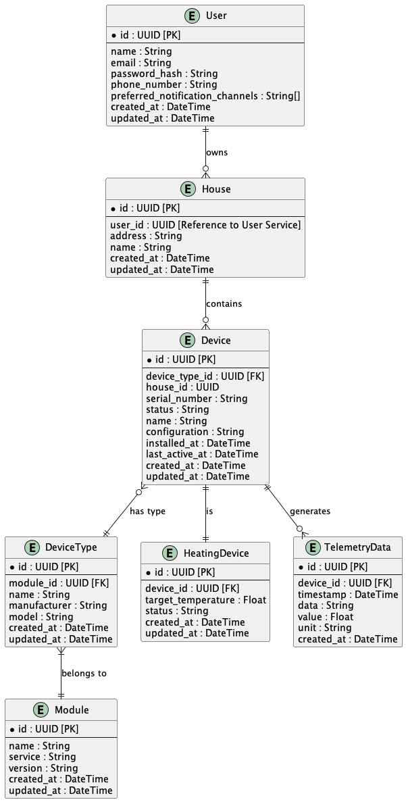

# ER-диаграмма

## Сущности:

### Сущность «Пользователь» (User)

`id` — уникальный идентификатор пользователя (первичный ключ)

`name` — имя пользователя

`email` — адрес электронной почты пользователя

`password_hash` — хеш пароля для аутентификации пользователя

`phone_number` — номер телефона пользователя

`preferred_notification_channels` — предпочитаемые каналы получения уведомлений (например, список из Email, SMS, Push)

`created_at` — дата и время создания учетной записи пользователя

`updated_at` — дата и время последнего обновления данных пользователя

### Сущность «Дом» (House)

`id` — уникальный идентификатор дома (первичный ключ)

`user_id` — идентификатор пользователя, которому принадлежит дом

`address` — адрес

`name` — название или описание дома

`created_at` — дата и время создания записи о доме

`updated_at` — дата и время последнего обновления данных дома

### Сущность «Устройство» (Device)

`id` — уникальный идентификатор устройства (первичный ключ)

`device_type_id` — идентификатор типа устройства

`house_id` — идентификатор дома, к которому привязано устройство

`serial_number` — серийный номер

`status` — текущее состояние устройства

`name` — название или описание устройства

`configuration` — настройки устройства

`installed_at` — дата и время установки

`last_active_at` — дата и время последней активности

`created_at` — дата и время создания записи об устройстве

`updated_at` — дата и время последнего обновления данных устройства

### Сущность «Тип устройства» (DeviceType)

`id` — уникальный идентификатор типа устройства (первичный ключ)

`module_id` — идентификатор модуля, к которому относится тип устройства

`name` — название типа устройства (например, «Термостат», «Датчик температуры»)

`manufacturer` — производитель устройства

`model` — модель устройства

`created_at` — дата и время создания записи о типе устройства

`updated_at` — дата и время последнего обновления данных о типе устройства

### Сущность «Модуль» (Module)

`id` — уникальный идентификатор модуля (первичный ключ)

`name` — название модуля (например, «Отопление», «Освещение»)

`service` - к какому сервису относится модуль (например, Heating)

`version` — версия модуля

`created_at` — дата и время создания записи о модуле

`updated_at` — дата и время последнего обновления данных модуля

### Сущность «Устройство отопления» (HeatingDevice)

`id` — уникальный идентификатор записи устройства отопления (первичный ключ)

`device_id` — идентификатор устройства в Device Service

`target_temperature` — заданная пользователем целевая температура

`created_at` — дата и время создания записи об устройстве отопления

`updated_at` — дата и время последнего обновления данных устройства отопления

### Сущность «Телеметрия» (TelemetryData)

`id` — уникальный идентификатор записи телеметрии (первичный ключ)

`heating_device_id` — идентификатор устройства отопления — внешний ключ к таблице HeatingDevice

`timestamp` — дата и время сбора данных

`data` — дополнительные данные телеметрии

`value` — числовое значение показателя

`unit` — единица измерения (например, «°C», «%»)

`created_at` — дата и время создания записи телеметрии

## Связи

Пользователь (1) — (M) Дом: один пользователь может иметь несколько домов, но каждый дом принадлежит только одному пользователю

Дом (1) — (M) Устройство: один дом может содержать несколько устройств, но каждое устройство связано с одним домом

Устройство (M) — (1) Тип устройства: много устройств могут быть одного типа, но каждое устройство имеет только один тип

Тип устройства (M) — (1) Модуль: много типов устройств могут принадлежать одному модулю, но каждый тип устройства связан только с одним модулем

Устройство отопления (1) — (1) Устройство: устройство отопления соответствует одному устройству из Device Service

Устройство отопления (1) — (M) Телеметрия: одно устройство отопления может генерировать много записей телеметрии

## Диаграмма

