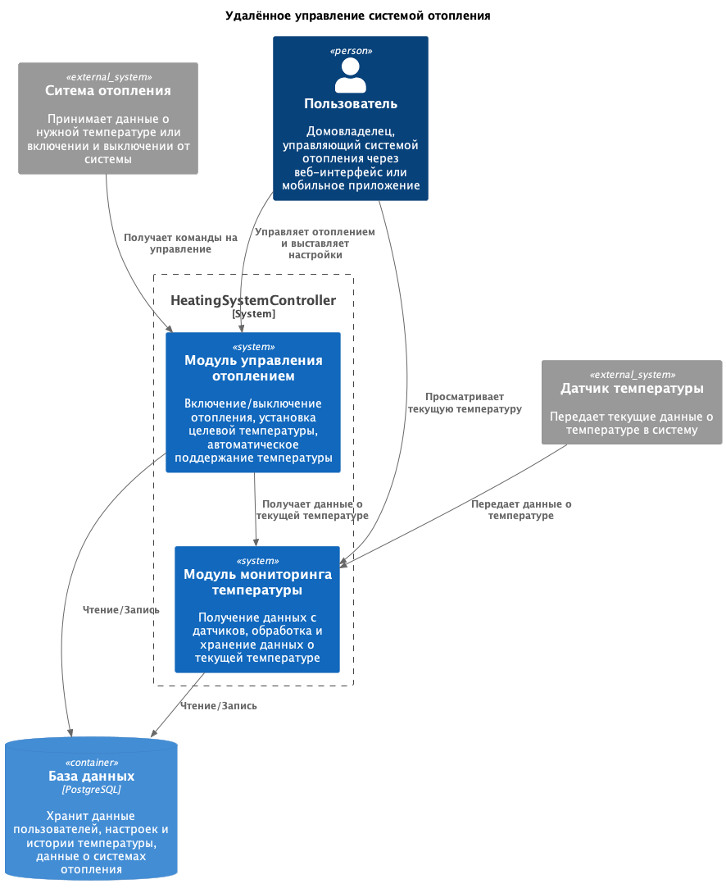

# Анализ и планирование

## Текущая архитектура приложения

-   **Язык программирования:** Java

-   **База данных:** PostgreSQL

-   **Архитектура:** Монолитная, все компоненты системы (обработка запросов, бизнес-логика, работа с данными) находятся в рамках одного приложения.

-   **Взаимодействие:** Синхронное, запросы обрабатываются последовательно.

-   **Масштабируемость:** Ограничена, так как монолит сложно масштабировать по частям.

-   **Развертывание:** Требует остановки всего приложения.

## Текущая функциональность приложения

-   **Управление системой отопления**

    -   Включение и выключение отопления:

        -   Пользователи могут удаленно включать или выключать систему отопления

        -   Реализовано через методы `turnOn(id)` и `turnOff(id)`

        -   Эти методы изменяют состояние системы отопления и сохраняют изменения в базе данных

    -   Установка целевой температуры:

        -   Пользователи могут устанавливать желаемую температуру для своих домов

        -   Метод `setTargetTemperature(id, temperature) `позволяет задать нужную температуру

        -   Система автоматически поддерживает желаемую температуру

    -   Получение информации о системе отопления:

        -   Метод `getHeatingSystem(id)` предоставляет данные о текущем состоянии системы отопления

    -   Обновление настроек системы отопления:

        -   Пользователи могут обновлять настройки своей системы отопления через метод `updateHeatingSystem(id, heatingSystemDto)`

-   **Мониторинг температуры**

    -   Получение текущей температуры:

        -   Метод getCurrentTemperature(Long id) возвращает текущую температуру

    -   Датчики температуры:

        -   Получение данных о текущей температуре от датчиков

## Диаграмма

Мною была составлена C4-диаграмма, чтобы проанализировать текущее архитектурное решение:

## Домены и границы контекстов

Из текущего приложения легко можно выделить несколько доменов:

-   **Домен управления устройствами:**
    Управление физическими устройствами отопления в домах пользователей

    -   Управление состоянием отопления (включение/выключение)
    -   Установка целевой температуры
    -   Автоматическое поддержание заданной температуры

-   **Домен мониторинга:**
    Сбор, обработка и хранение данных о текущей температуре

    -   Получение данных с датчиков температуры
    -   Обработка данных с датчиков и их хранение
    -   Предоставление информации о текущем состоянии

-   **Домен пользователя:**
    Обеспечение взаимодействия пользователей с системой

    -   Авторизация пользователей
    -   Взаимодействие пользователей с системой
