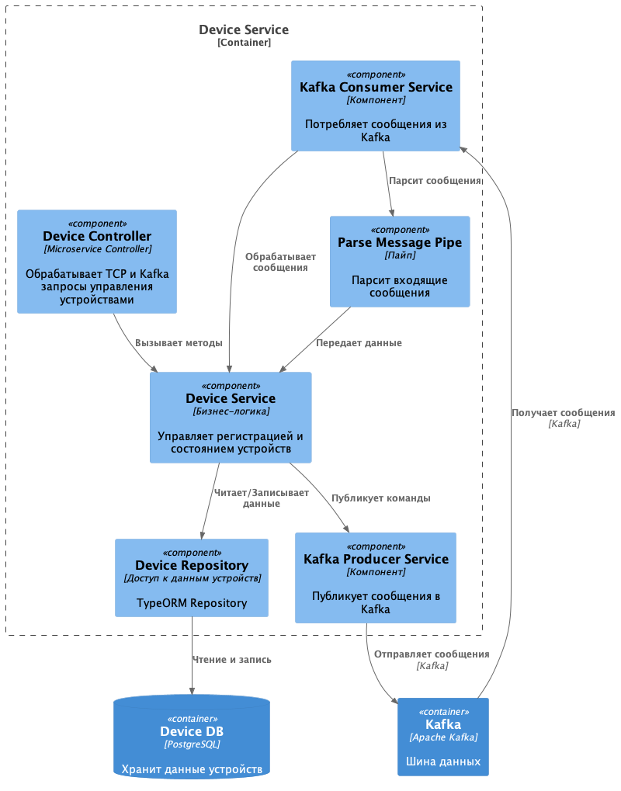
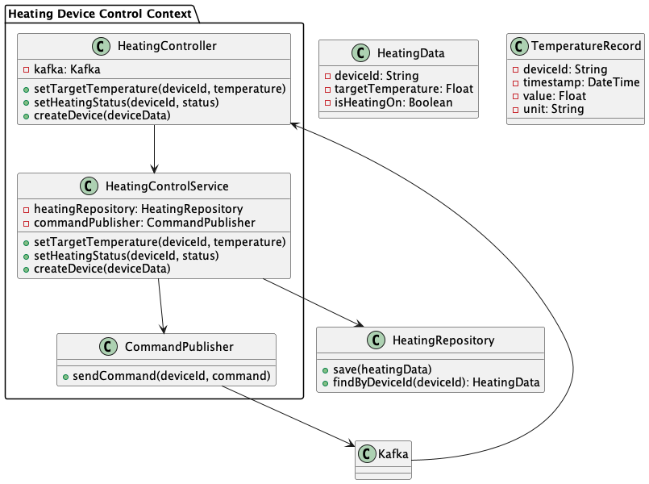

# Архитектура микросервисов

## Разделение на микросервисы

-   **Микросервис управления отоплением (Heating Service)**

    -   Управление устройствами отопления
    -   Включение/выключение отопления
    -   Установка и поддержание целевой температуры

-   **Микросервис Телеметрии**

    -   Мониторинг текущей температуры

-   **Микросервис пользователей (User Service)**

    -   Аутентификация и авторизация пользователей
    -   Управление данными пользователей

-   **Микросервис управления устройствами (Device Service)**

    -   Регистрация новых устройств
    -   Архивация неактивный устройств
    -   Отправление команд на обновление настроек устройств

-   **Микросервис уведомлений (Notification Service)**

    -   Отправка уведомлений пользователям

-   **API Gateway**

    -   Точка входа для клиентских приложений
    -   Маршрутизация запросов к микросервисам
    -   Мониторинг

-   **Kafka**

    -   Асинхронное взаимодействие между микросервисами
    -   Обработка событий в реальном времени

-   **Базы данных**

    Каждый микросервис владеет собственной базой данных, обеспечивая изоляцию данных и независимость сервисов

## Диаграммы

Мной были составлены диаграммы для наглядной визуализации архитектуры

### Уровень контейнеров

### Уровень сервисов

#### User Service

#### Notification Service

#### House Service

#### Telemetry Service

#### Heating Service

#### Device Service

##### Взаимодействие Device Service и Heating Service

Здесь наглядно видно, как будут обновляться данные на устройствах

### Уровень кода

#### Heating Service Code

